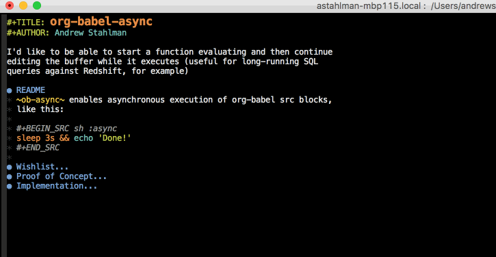

`ob-async` enables asynchronous execution of org-babel src blocks,
like this:

`ob-async` isn't tied to src blocks in a specific org-babel
language. Simply add the keyword `:async` to the header-args of any
org-babel src block and invoke `ob-async-org-babel-execute-src-block`.

## Installation

`ob-async` is available in MELPA. If you'd rather install from source,
make sure `ob-async.el` is on your `load-path`, like this.

    (add-to-list 'load-path "$PATH_TO_OB_ASYNC_ROOT_DIR")

Require the package and `ob-async` will handle any source block which
includes `:async` in its header-args.

    (require 'ob-async)

## Configuration

`ob-async` should work with no additional setup for most
languages. However, there are a few known edge-cases which require
extra configuration.

### ob-async-no-async-languages-alist

Some org-babel languages (e.g., `ob-python`) define their own `:async`
keyword that conflicts with `ob-async`. `ob-async` will ignore any
languages in this blacklist, even if the `:async` keywords is
present. Note that the `-alist` suffix is misleading; this variable
actually represents a plain list and will be renamed in a future
release.

Example:

    (setq ob-async-no-async-languages-alist '("ipython"))

For additional context, see
https://github.com/astahlman/ob-async/pull/35.

### ob-async-pre-execute-src-block-hook

Some org-babel languages require additional user configuration. For
example, `ob-julia` requires `inferior-julia-program-name` to be
defined. Normally you would define such variables in your `init.el`,
but src block execution occurs in an Emacs subprocess which does not
evaluate `init.el` on startup. Instead, you can place initialization
logic in `ob-async-pre-execute-src-block-hook`, which runs before
execution of every src block.

Example:

    (add-hook 'ob-async-pre-execute-src-block-hook
            '(lambda ()
               (setq inferior-julia-program-name "/usr/local/bin/julia")))

For additional context, see
https://github.com/astahlman/ob-async/issues/37 and
https://github.com/jwiegley/emacs-async/pull/73.

## Development

[Cask](https://github.com/cask/cask) manages dependencies and runs
tests. Once Cask is installed, you can `make test`.

## Troubleshooting

First, go through the troubleshooting checklist,
`troubleshooting.org`. It's an org-mode file in this repository that's
designed to diagnose issues with ob-async. If that doesn't solve your
problem, include a copy of the entire file (which will include your
`#+RESULTS` blocks) in a Github issue.
